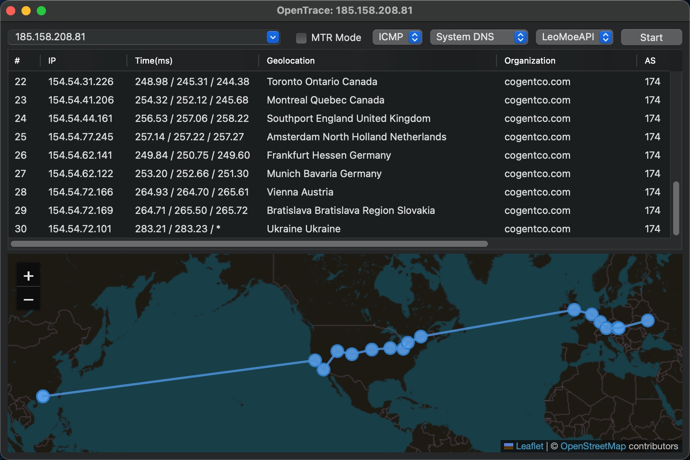
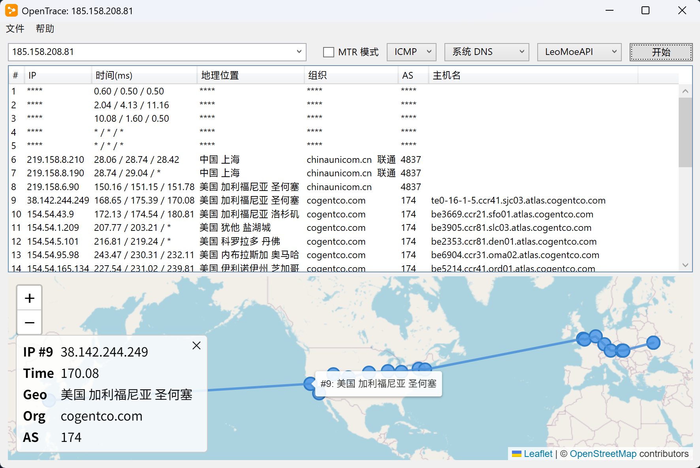
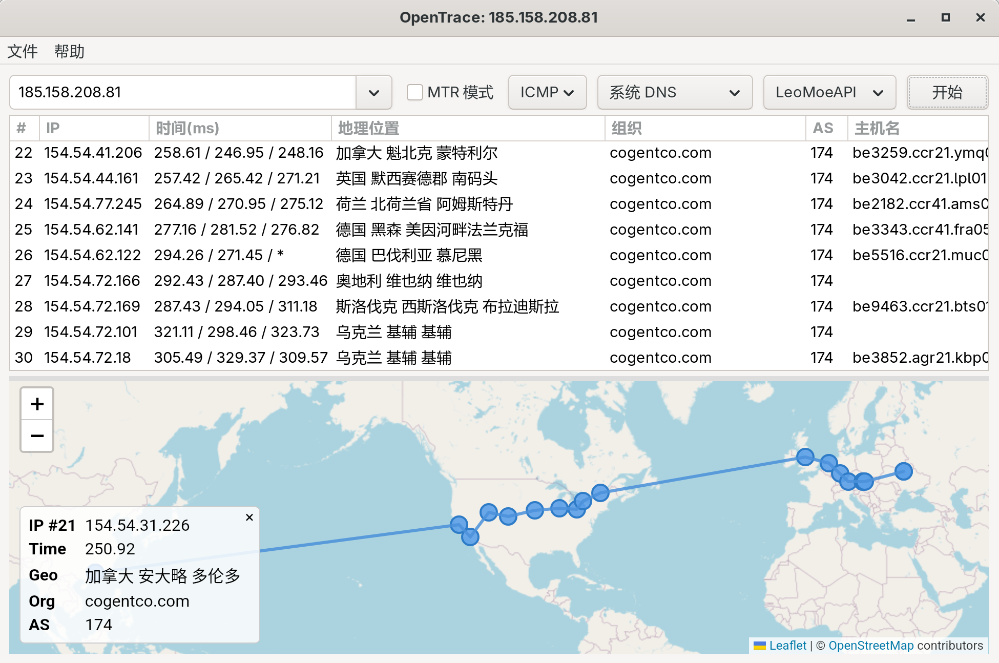

[English | <a href="readme_zh.md">中文</a>]

<h3>
  <a href="https://opentrace.app">🌐 Official Website</a>
</h3>

## OpenTrace

OpenTrace is an open source visualized route tracing tool.

OpenTrace 是一款跨平台可视化路由追踪工具。

### Usage

- Download OpenTrace for your system from the [official website](https://opentrace.app) or [releases](https://github.com/Archeb/opentrace/releases). Linux users can also install it via [Flathub](https://flathub.org/en/apps/io.github.Archeb.opentrace) or [Arch User Repository](https://aur.archlinux.org/packages/opentrace-bin/).

Alternatively, if you compiled it yourself, then you need to:

- Download and install NextTrace: Download NextTrace for your system architecture from [here](https://github.com/nxtrace/NTrace-core/releases).

- Place NextTrace in the OpenTrace directory, or in a directory included in your system's PATH environment variable; you can also place it anywhere and manually specify the path (recommended for macOS users).

- If you are a **Windows user** and want to use TCP/UDP Traceroute, you also need to [download and install Npcap](https://npcap.com/#download).

- Unzip and run OpenTrace(.exe)

### Features

- [x] Cross-platform native GUI (Windows WPF / Linux GTK / macOS)

- [x] An interface you are familiar with, but with even more powerful functionalities

- [x] User-friendly GUI and easy-to-understand parameter descriptions

- [x] MTR (My Traceroute) functionality

- [x] Multi-language support (English, Chinese, French, Spanish, Japanese, Russian)

- [x] Custom DNS Resolvers (DNS, DoH)

- [x] Use CLI to start a trace

- [x] Supports local .MMDB database

More is coming... [Feature request](https://github.com/Archeb/opentrace/issues/new/choose) is welcome!

> **Tip**: You can also download the latest beta version of the corresponding architecture from the [Actions page of this project](https://github.com/Archeb/opentrace/actions); however, it may contain bugs or vulnerabilities, or may be unstable.

### Microsoft Store package

The Store build uses the reserved `NYALabs.OpenTrace` identity and produces a
combined x64/ARM64 MSIX bundle with pinned, hash-verified NextTrace binaries.
See [STORE-SUBMISSION.md](STORE-SUBMISSION.md) for build and submission
instructions.

### Images

### Credit

OpenTrace uses [NextTrace](https://github.com/nxtrace/NTrace-core) as the backend.

### License

OpenTrace is released under the [GPL-3.0 license](LICENSE.txt).
