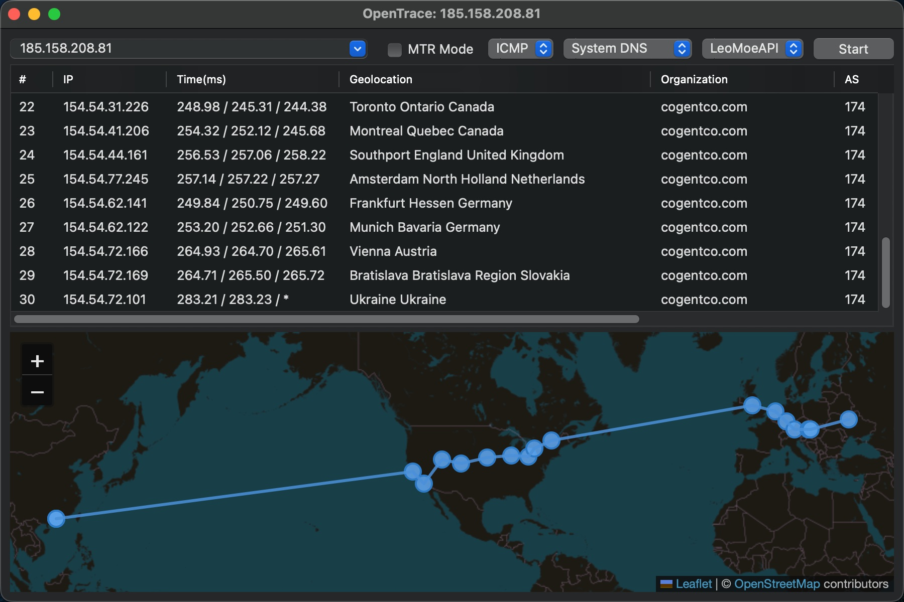

## OpenTrace

OpenTrace 是 NextTrace 的跨平台 GUI 界面，带来您熟悉但更强大的用户体验。

### 使用方法

- 从 [releases](https://github.com/Archeb/opentrace/releases) 里下载对应系统的 OpenTrace，Linux 用户也可通过 [Flathub](https://flathub.org/en/apps/io.github.Archeb.opentrace) 或 [Arch User Repository](https://aur.archlinux.org/packages/opentrace-bin/) 安装

或者如果您选择自己编译，那么您还需要：

  
- 下载并安装 NextTrace: 从 [这里](https://github.com/nxtrace/Ntrace-V1/releases) 下载对应系统架构的 NextTrace。

- 将 NextTrace 放置于 OpenTrace 目录下，或者放置到系统 PATH 环境变量包含的目录中；您亦可以放到任意位置并手动指定路径（macOS 用户推荐）。

- 如果您是 **Windows 用户**，想使用 TCP/UDP Traceroute，还需要[下载并安装 Npcap](https://npcap.com/#download)

- 解压并运行 OpenTrace(.exe)

### 功能

- [x] 跨平台原生GUI（Windows WPF / Linux GTK / macOS）

- [x] 您熟悉但功能更强大的界面

- [x] 用户友好的GUI和易于理解的参数描述

- [x] MTR (My Traceroute) 功能

- [x] 多语言支持（中文、英文、法语、西班牙语、日语、俄语）

- [x] 自定义 DNS 服务器 (DNS、DoH)

- [x] 支持使用本地 MMDB 格式的 IP 数据库

- [x] 使用命令行来启动一次路由追踪

- [x] 隐私打码功能，可以隐藏前几跳的IP、rDNS与位置信息

新功能不断添加中...欢迎向我们[提出功能请求](https://github.com/Archeb/opentrace/issues/new/choose)！

提示：您也可以在[本项目的 Actions 页面](https://github.com/Archeb/opentrace/actions) 下载对应架构的最新测试版；但其可能包含错误或者漏洞，或出现运行不稳定等现象。

### 预览图

